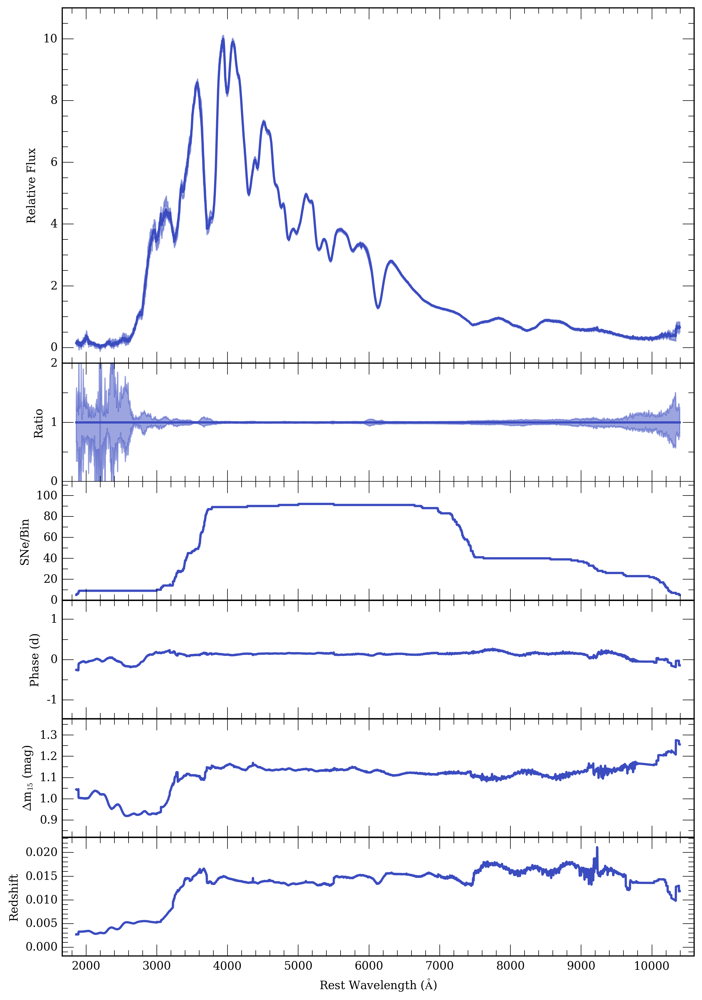

==========================
Creating Composite Spectra
==========================

Here we outline how to generate composite spectra using the methods of `Siebert et al. 2019 <https://msiebert1.github.io/publication/2019-XX-XX-Siebert_2019_MNRAS>`_. Start by defining ``query_list`` such that it describes the subset of data that for which you wish to generate a composite spectrum. Then run the ``make_composite``:

.. code_block:: python

	query_list = ["SELECT * from Spectra inner join Events ON Spectra.SN = Events.SN where phase >= -1 and phase <= 1 and ((dm15_source < 1.8) or (dm15_from_fits < 1.8))"]
	composites, sn_arrays, boot_sn_arrays = kpora.make_composite(query_list, boot=False, medmean=1, verbose=False, gini_balance=True, combine=True)

This will generate a composite spectrum for each query in ``query_list`` and will take of order seconds to minutes depending on the size of the sample. A composite spectrum is a spectrum object that contains a few more attributes. ``phase_array``, ``dm15_array``, and ``red_array`` contain the weighted averages of phase, dm15, and redshift as a function of wavelength. ``sn_arrays`` contains the list of combined spectrum objects used to construct the composite spectrum.

Other applications of the available ``make_composite`` arguments are listed below

``boot = True``: estimate the 1-sigma confidence intervals via 100 random resamples of the spectra (this significantly increases computation time). This will populate the ``low_conf`` and ``up_conf`` attributes of the composites spectrum objects. This also populates ``boot_sn_arrays`` with a list of composite spectra generated from these resamples.

``medmean = 2``: a median composite spectrum will be generated.

``verbose = False``: prints basic information about each spectrum contributing to the composite spectrum.

``gini_balance = False``: does an inverse-variance weighted average of the original data (this is more susceptible to high SNR outliers). For more information on our Gini-weighting method please read our paper.

``combine = False``: does not intitally combine spectra from the same SNe. 

We also provide a useful plotting function to visualize your composite spectra. This will also output the average properties of the composite spectra within wavelength ranges defined by ``set_min_num_spec``.

.. code_block:: python
	kpora.set_min_num_spec(composites, 5) # require at least 5 spectra for determining average properties
	kplot.comparison_plot(composites, min_num_show=5)

